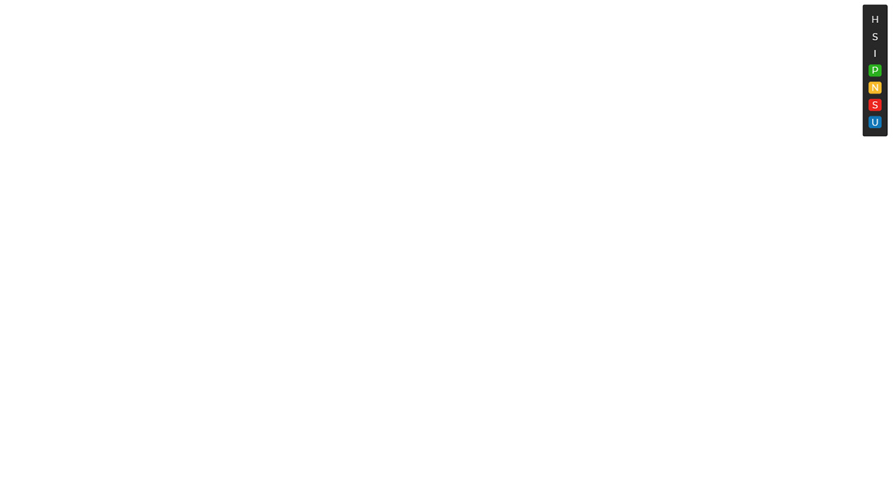

# CasparCG HTML Template Developer Widget

The widget is made up of an HTML, CSS or SCSS, and JS file. Each file has some comments in them but please feel free to reach out to me with any questions.</br>

Join the discussion on the [CasparCG Forum](https://casparcgforum.org/).

## Features
Change the background color quickly using a HEX, RGB or, RGBA values without editing the CSS file.</br>
Run Custom Commands from the widget. Eliminates the need for a ton of snippets or typing the function into the console.</br>
Easily run the standard Play, Next, and Stop Commands.

### Setup
1. Add this bit of code to a JS file that will be loaded with the template. Don't forget to  change the `DEV_SCRIPT_URL`. 

```js
// Create an enviorment vairiable to control if the widget is loaded
const ENV = 'DEV';
// Change DEV_SCRIPT_URL to the url the dev.js script will be served from 
const DEV_SCRIPT_URL = '';

window.onload = () => {
    if(ENV && ENV === 'DEV') {
        const script = document.createElement('script');
        script.type = "application/javascript";
        script.src = DEV_SCRIPT_URL;
        document.querySelector('body').append(script);
    }
};
```

2. Open the dev.js file and edit `HTML_URL` and `STYLESHEET_URL` to the URL the these files will be served from.
3. And your done! The data is stored in the browser's local storage so as long as you use the same URL for each graphic, your widget style and position should be persistent. 

### Some Images of the Widget for Reference





### Coming Soon
A way to save and load update data from the widget. Would once again eliminate the need for numerous snippets.</br>

### A Few Extra Details
This was built for CasparCG version 2.2.0 Stable. </br>
The Chromium version for CasparCG is 63.0.3239.132 and the widget was built in version 63.0.3239.0 which can be found [here](https://commondatastorage.googleapis.com/chromium-browser-snapshots/index.html?prefix=Win_x64/508578/).</br>
Find Chromium download by version [here](https://omahaproxy.appspot.com/). The Branch Base Position is the folder on [this page](https://commondatastorage.googleapis.com/chromium-browser-snapshots/index.html?prefix=Win_x64/).

Please reach out with additions, suggestions, improvements or really anything! 