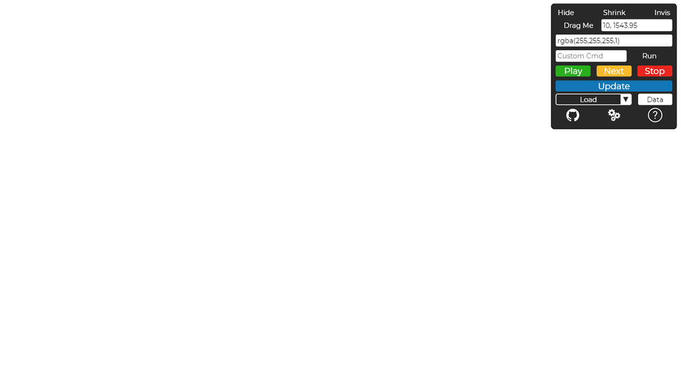

# CasparCG HTML Template Developer Widget

The widget is made up of just one JS file! There are formatted versions of each component in the dependencies folder.</br>

Join the discussion on the [CasparCG Forum](https://casparcgforum.org/).

## Features
Change the background color quickly using a HEX, RGB or, RGBA values without editing the CSS file.</br>
Set the background to an image using a URL.</br>
Run custom commands (Invoke Command) from the widget.</br>
Easily run the standard Update, Play, Next, and Stop Commands.</br>
Set custom data with a convenient GUI that is injected into the graphic template.</br>
All data is persistent between page reloads!

## Live Demo
Try the live demo [here](http://www.casparcgwidget.com)!

## Setup
1. Add this bit of code to a JS file that will be loaded with the template. Don't forget to  change the `DEV_SCRIPT_URL`. 

```js
// Create an enviorment vairiable to control if the widget is loaded
const ENV = 'DEV';
// Change DEV_SCRIPT_URL to the url the dev.js script will be served from 
const DEV_SCRIPT_URL = '';

window.onload = () => {
    if(ENV && ENV === 'DEV') {
        const script = document.createElement('script');
        script.type = "application/javascript";
        script.src = DEV_SCRIPT_URL;
        document.querySelector('body').append(script);
    }
};
```

2. And your done! The template data is stored in the browser's IndexedDB and it persistent between page reloads. The widget's data is stored in the browser's local storage.

### Alternative Setup
You can load the `dev.js` file directly in your HTML by adding the following line.

```html
<script rel="application/javascript" src="http://yourwebserver/dev.js"></script>
```

Then visit the template's URL with `?debug=true` as the query string. </br>

Example: `http://localhost/html/template.html?debug=true` </br>

Check the developers console for additional info.

### Widget API

The widget offers a full API for interacting with the template. </br>
For the full list, type `DEVWIDGET.help` into the console or press the help button on the widget.

### Some Images of the Widget for Reference




### A Few Extra Details
This was built for CasparCG version 2.2.0 Stable. </br>
The Chromium version for CasparCG is 63.0.3239.132 and the widget was built in version 63.0.3239.0 which can be found [here](https://commondatastorage.googleapis.com/chromium-browser-snapshots/index.html?prefix=Win_x64/508578/).</br>
Find Chromium download by version [here](https://omahaproxy.appspot.com/). The Branch Base Position is the folder on [this page](https://commondatastorage.googleapis.com/chromium-browser-snapshots/index.html?prefix=Win_x64/).

Please reach out with additions, suggestions, improvements or really anything! 